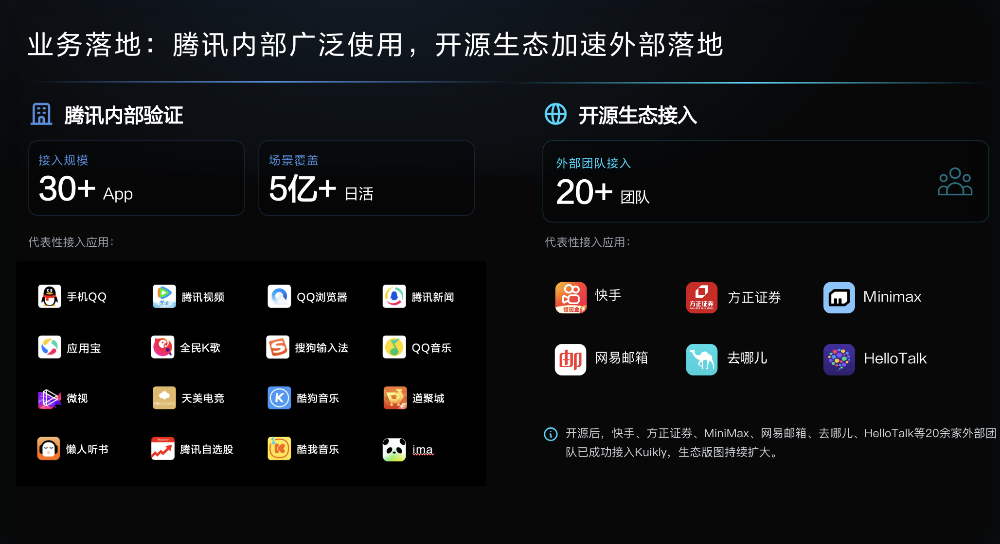

# 应用场景案例

## 生产实践与能力支撑

Kuikly 已在腾讯 30+ 业务深度使用，覆盖 1000+ 页面、5亿+日活用户，并在短视频直播、音乐、信息Feeds流、AI对话、金融、游戏社区、高性能动态化运营等复杂场景长期运行。

Kuikly以原生级性能体验、高性能动态化、原生技术栈和官方鸿蒙支持等特色，为跨端业务提供了生产级解决方案。下面从业务接入和典型应用场景，列举部分案例供参考。
 开源后，外部业务也在积极体验和接入到项目进行跨平台开发；在征得业务同意后，后续会逐步补充典型外部案例。

## 使用业务

## 典型场景
1. **短视频直播**

2. **音乐**

3. **信息Feeds流**

4. **AI对话**

5. **金融**

6. **游戏社区**

7. **高性能动态化运营场景**

